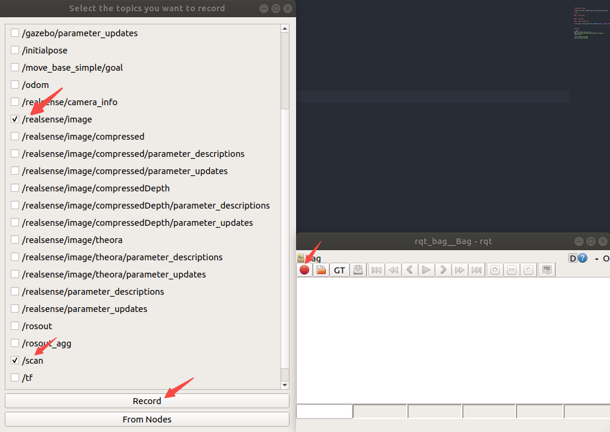
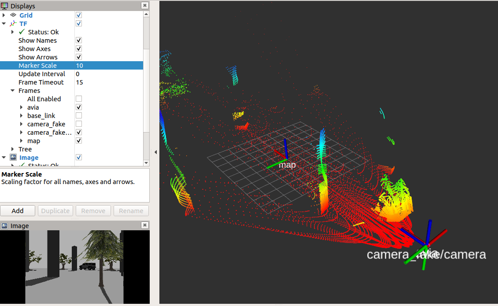
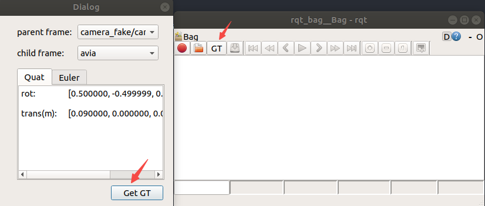

# Modified rqt_bag

forked from https://github.com/ros-visualization/rqt_bag

## Func.

### 1. Record bag and load bag



### 2. Show Ground-truth

to be used in conjunction with [obj6dof](https://github.com/Rick0514/obj6dof)(a sim platform)



add button to obtain arbitrary 2 frames' ground truth extrinsic in simulation platform.




## Usage

```bash
mkdir -p ws/src && cd ws/src
git clone https://github.com/Rick0514/rqt_bag.git
catkin build

source devel/setup.bash
rosrun rqt_bag rqt_bag
```

## Ref.

1. how to get all frames: http://wiki.ros.org/rqt_tf_tree
2. create rqt plugin: http://wiki.ros.org/rqt/Tutorials/Create%20your%20new%20rqt%20plugin
3. original repo.: https://github.com/ros-visualization/rqt_bag
4. http://wiki.ros.org/python_qt_binding
5. plugins: http://wiki.ros.org/rqt/Plugins